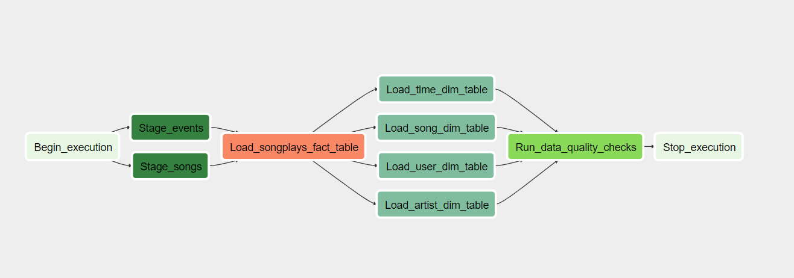

# Project: Date Pipeline using Airflow

A music streaming company, Sparkify, has decided that it is time to introduce more automation and monitoring to their data warehouse ETL pipelines and come to the conclusion that the best tool to achieve this is Apache Airflow.

They have decided to bring you into the project and expect you to create high grade data pipelines that are dynamic and built from reusable tasks, can be monitored, and allow easy backfills. They have also noted that the data quality plays a big part when analyses are executed on top the data warehouse and want to run tests against their datasets after the ETL steps have been executed to catch any discrepancies in the datasets.

The source data resides in S3 and needs to be processed in Sparkify's data warehouse in Amazon Redshift. The source datasets consist of JSON logs that tell about user activity in the application and JSON metadata about the songs the users listen to.

---

## Airflow Components

#### DAG

DAG  (Directed acyclic graph) of this Airflow data pipeline consists of multiple steps. Firstly,The raw data files will be extracted from S3 and loaded into the staging data database on Redshift. These data will then be loaded into a fact table and multiple dimension tables on the same Redshift data warehouse. At the end, a quality check will be executed to confirm data has been loaded successfully.

In the DAG, `default parameters` are based on these guidelines:

- The DAG does not have dependencies on past runs
- On failure, the task are retried 3 times
- Retries happen every 5 minutes
- Catchup is turned off
- Do not send email on retry

In addition, task dependencies have been configured follows the flow shown in the image below.



#### Operators

Four custom operators has been created to stage the data, transform the data, and run checks on data quality. These operators utilized Airflow's built-in functionalities as connections and hooks as much as possible to ensure Airflow will do all the heavy-lifting when it is possible

All of the operators and task instances will run SQL statements against the Redshift database. Multiple parameters have been set, so that we can later apply these flexible, reusable, and configurable operators to many kinds of data pipelines with Redshift and with other databases:

- Stage operator
  - redshift_conn_id: connection ID of the redshift cluster configured under connection page 
  - aws_credential_id: connection ID of the redshift cluster configured under connection page
  - table: name of destination staging tables
  - s3_bucket: folder of the s3 bucket where the source is located
  - s3_key: sub-folder of the s3 bucket where the source data is located
  - region:  AWS Region where the source data is located
  - file_format: format of the source file
  - json_path: necessary if the JSON data objects don't correspond directly to column names; set to 'AUTO' if not applicable
- Fact and Dimension Operators
  - redshift_conn_id: connection ID of the redshift cluster configured under connection page
  - table: name of destination fact or dimension tables
  - load_sql: SQL statements that load data from staging tables to destination tables
  - append_data: If False, then delete the destination table before loading the data
- Data Quality Operator
  - redshift_conn_id: connection ID of the redshift cluster configured under connection page
  - tables: a list of tables to be checked. `SELECT` statement will be run against each table to check if it contain any records

#### Connections

To ensure the Airflow can connect to the necessary S3 and Redshift services. Two connection information need to be created under connection page using Airflow's UI.

###### AWS Credentials

- **Conn Id**: Enter `aws_credentials`.
- **Conn Type**: Enter `Amazon Web Services`.
- **Login**: Enter your **Access key ID** from the IAM User credentials.
- **Password**: Enter your **Secret access key** from the IAM User credentials.


###### Redshift Cluster

- **Conn Id**: Enter `redshift`.
- **Conn Type**: Enter `Postgres`.
- **Host**: Enter the endpoint of your Redshift cluster, excluding the port at the end. You can find this by selecting your cluster in the **Clusters** page of the Amazon Redshift console. See where this is located in the screenshot below. IMPORTANT: Make sure to **NOT** include the port at the end of the Redshift endpoint string.
- **Schema**: Enter `dev`. This is the Redshift database you want to connect to.
- **Login**: Enter `awsuser`.
- **Password**: Enter the password you created when launching your Redshift cluster.
- **Port**: Enter `5439`.


---

## Sample Data

#### Location

 S3 links for the datasets for songs and logs:

- Song data: `s3://udacity-dend/song_data`
- Log data: `s3://udacity-dend/log_data`

Log data json path: `s3://udacity-dend/log_json_path.json`

#### Song Data

Each file is in JSON fomart date file contains metadata about a song and the artist of that song.

```json
{"num_songs": 1, "artist_id": "ARJIE2Y1187B994AB7", "artist_latitude": null, "artist_longitude": null, "artist_location": "", "artist_name": "Line Renaud", "song_id": "SOUPIRU12A6D4FA1E1", "title": "Der Kleine Dompfaff", "duration": 152.92036, "year": 0}
```

#### Log Data

Each file is in JSON fomart log file contains activity logs from a music streaming app based on specified configurations. 

```json
{"artist":null,"auth":"Logged In","firstName":"Walter","gender":"M","itemInSession":0,"lastName":"Frye","length":null,"level":"free","location":"San Francisco-Oakland-Hayward, CA","method":"GET","page":"Home","registration":1540919166796.0,"sessionId":38,"song":null,"status":200,"ts":1541105830796,"userAgent":"\"Mozilla\/5.0 (Macintosh; Intel Mac OS X 10_9_4) AppleWebKit\/537.36 (KHTML, like Gecko) Chrome\/36.0.1985.143 Safari\/537.36\"","userId":"39"}## Database Schema
```

Because the key names of log data json files might be different from the columns names of the table to be loaded. We will need an additonal json path file to parse the data.

---

## Database Schema

#### Database Schema Diagram


#### Fact Table

**songplays**

| Column      | Type               |
| ----------- | ------------------ |
| songplay_id | SERIAL PRIMARY KEY |
| start_time  | timestamp          |
| user_id     | int                |
| level       | varchar            |
| song_id     | varchar            |
| artist_id   | varchar            |
| session_id  | int                |
| location    | varchar            |
| user_agent  | varchar            |

#### Dimension Tables

**users**

| Column     | Type            |
| ---------- | --------------- |
| user_id    | int PRIMARY KEY |
| first_name | varchar         |
| last_name  | varchar         |
| gender     | varchar         |
| levek      | varchar         |

###### **songs**

| Column    | Type                |
| --------- | ------------------- |
| song_id   | varchar PRIMARY KEY |
| title     | varchar             |
| artist_id | varchar             |
| year      | varchar             |
| duration  | varchar             |

###### **artists**

| Column    | Type                |
| --------- | ------------------- |
| artist_id | varchar PRIMARY KEY |
| name      | varchar             |
| location  | varchar             |
| latitude  | float               |
| longitude | float               |

###### **time**

| Column     | Type                  |
| ---------- | --------------------- |
| start_time | timestamp PRIMARY KEY |
| hour       | int                   |
| day        | int                   |
| week       | int                   |
| month      | int                   |
| year       | int                   |
| weekday    | int                   |

---

## ETL Pipeline

To run the ETL, user will need to 

1. Create a redshift cluster and run `create_tables.sql` to create necessary tables.

2. Run `/opt/airflow.start.sh` to start the Airflow server

3. Click 'Tigger Dag' button to start the instance

---

## Sample Data Analysis

If the records were successfully inserted, data can be analyzed using queries.

For example. to return the top 10 users who listen the most number of songs, run query:

```sql
SELECT 
    users.first_name, 
    users.last_name, 
    count(songplays.userid) as count 
FROM songplays 
    JOIN users ON songplays.userid = users.userid 
GROUP BY 
    songplays.userid, 
    users.first_name, 
    users.last_name 
ORDER BY count DESC 
LIMIT 10;
```

The output should be:

| first_name | last_name | count |
| ---------- | --------- | ----- |
| Chloe      | Cuevas    | 689   |
| Tegan      | Levine    | 665   |
| Kate       | Harrell   | 557   |
| Lily       | Koch      | 463   |
| Aleena     | Kirby     | 397   |
| Jacqueline | Lynch     | 346   |
| Layla      | Griffin   | 321   |
| Jacob      | Klein     | 289   |
| Mohammad   | Rodriguez | 270   |
| Matthew    | Jones     | 248   |
