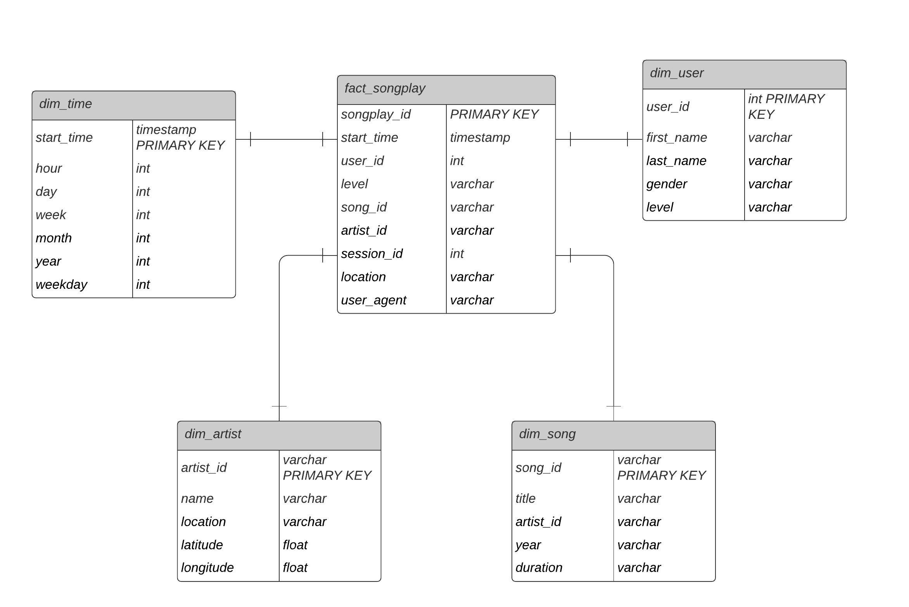

# Project: Cloud Data Warehouse

A music streaming startup, Sparkify, has grown their user base and song database and want to move their processes and data onto the cloud. Their data resides in S3, in a directory of JSON logs on user activity on the app, as well as a directory with JSON metadata on the songs in their app.

This projects aims to create an ETL pipeline that extracts their data from S3, stages them in Redshift, and transforms data into a set of dimensional tables for the analytics team to continue finding insights in what songs their users are listening to.

---

## Sample Data

#### Location

 S3 links for the datasets for songs and logs:

- Song data: `s3://udacity-dend/song_data`
- Log data: `s3://udacity-dend/log_data`

Log data json path: `s3://udacity-dend/log_json_path.json`

#### Song Data

Each file is in JSON fomart date file contains metadata about a song and the artist of that song.

```json
{"num_songs": 1, "artist_id": "ARJIE2Y1187B994AB7", "artist_latitude": null, "artist_longitude": null, "artist_location": "", "artist_name": "Line Renaud", "song_id": "SOUPIRU12A6D4FA1E1", "title": "Der Kleine Dompfaff", "duration": 152.92036, "year": 0}
```

#### Log Data

Each file is in JSON fomart log file contains activity logs from a music streaming app based on specified configurations. 

```json
{"artist":null,"auth":"Logged In","firstName":"Walter","gender":"M","itemInSession":0,"lastName":"Frye","length":null,"level":"free","location":"San Francisco-Oakland-Hayward, CA","method":"GET","page":"Home","registration":1540919166796.0,"sessionId":38,"song":null,"status":200,"ts":1541105830796,"userAgent":"\"Mozilla\/5.0 (Macintosh; Intel Mac OS X 10_9_4) AppleWebKit\/537.36 (KHTML, like Gecko) Chrome\/36.0.1985.143 Safari\/537.36\"","userId":"39"}## Database Schema
```

Because the key names of log data json files might be different from the columns names of the table to be loaded. We will need an additonal json path file to parse the data.

---

## Database Schema

#### Database Schema Diagram



#### Fact Table

###### Songplays

| Column      | Type               |
| ----------- | ------------------ |
| songplay_id | SERIAL PRIMARY KEY |
| start_time  | timestamp          |
| user_id     | int                |
| level       | varchar            |
| song_id     | varchar            |
| artist_id   | varchar            |
| session_id  | int                |
| location    | varchar            |
| user_agent  | varchar            |

#### Dimension Tables

###### **users**

| Column     | Type            |
| ---------- | --------------- |
| user_id    | int PRIMARY KEY |
| first_name | varchar         |
| last_name  | varchar         |
| gender     | varchar         |
| levek      | varchar         |

###### **songs**

| Column    | Type                |
| --------- | ------------------- |
| song_id   | varchar PRIMARY KEY |
| title     | varchar             |
| artist_id | varchar             |
| year      | varchar             |
| duration  | varchar             |

###### **artists**

| Column    | Type                |
| --------- | ------------------- |
| artist_id | varchar PRIMARY KEY |
| name      | varchar             |
| location  | varchar             |
| latitude  | float               |
| longitude | float               |

###### **time**

| Column     | Type                  |
| ---------- | --------------------- |
| start_time | timestamp PRIMARY KEY |
| hour       | int                   |
| day        | int                   |
| week       | int                   |
| month      | int                   |
| year       | int                   |
| weekday    | int                   |

---

## ETL Pipeline

To run the ETL, user will need to add redshift database and IAM role info to `dwh.cfg`.

After completing the config file, execute the following commands:

```shell
python create_tables.py
python etl.py
```

The sample data in songplays table:

| songplay_id | start_time                 | user_id | level | song_id | artist_id | session_id | location                        | user_agent                                                              |
| ----------- | -------------------------- | ------- | ----- | ------- | --------- | ---------- | ------------------------------- | ----------------------------------------------------------------------- |
| 1           | 2018-11-30 00:22:07.796000 | 91      | free  | None    | None      | 829        | Dallas-Fort Worth-Arlington, TX | Mozilla/5.0 (compatible; MSIE 10.0; Windows NT 6.2; WOW64; Trident/6.0) |

---

## Sample Data Analysis

If the records were successfully inserted, data can be analyzed using queries.

For example. to return the top 10 users who listen the most number of songs, run query:

```sql
SELECT 
    users.first_name, 
    users.last_name, 
    count(songplays.user_id) as count 
FROM songplays 
    JOIN users ON songplays.user_id = users.user_id 
GROUP BY 
    songplays.user_id, 
    users.first_name, 
    users.last_name 
ORDER BY count DESC 
LIMIT 10;
```

The output should be:

| first_name | last_name | count |
| ---------- | --------- | ----- |
| Chloe      | Cuevas    | 689   |
| Tegan      | Levine    | 665   |
| Kate       | Harrell   | 557   |
| Lily       | Koch      | 463   |
| Aleena     | Kirby     | 397   |
| Jacqueline | Lynch     | 346   |
| Layla      | Griffin   | 321   |
| Jacob      | Klein     | 289   |
| Mohammad   | Rodriguez | 270   |
| Matthew    | Jones     | 248   |